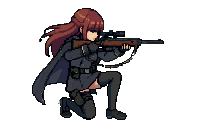
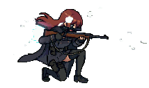
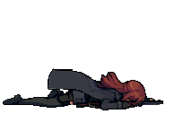
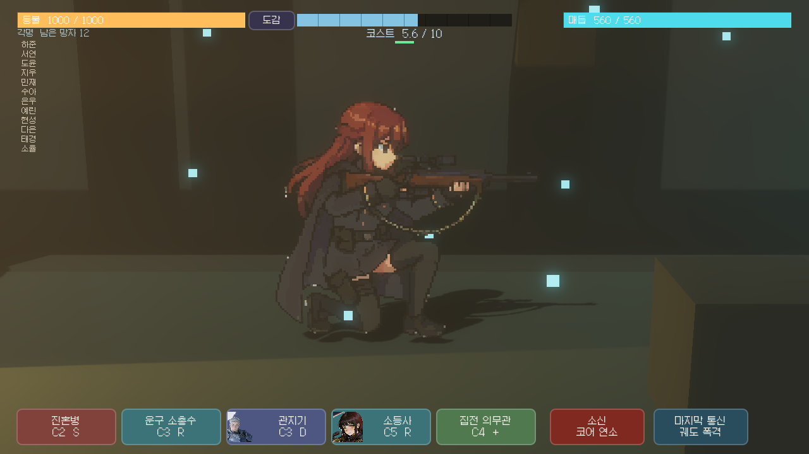

# Vesper — Godot 게임 에셋 파이프라인

AI로 만든 캐릭터를 정지 이미지로 붙이는 대신, 상태별 스프라이트를 반복 생성하고 결정적으로 조립한 뒤 Godot 런타임에서 검증하는 제작 파이프라인입니다.

> 게임 소스와 디자인은 비공개입니다. 이 저장소는 기술 아트 파이프라인, 실제 스프라이트와 런타임 결과를 공개합니다.

## 실제 결과

<p>
  
  
  
  
  
  
</p>



## 한눈에 보기

| | |
|---|---|
| **Role** | 파이프라인 설계·구현 1인 개발 |
| **Problem** | 프레임별 AI 생성에서 캐릭터와 무기 형태가 계속 달라짐 |
| **Build** | 상태 기반 생성 → 공통박스·발 정렬 → Godot 상태기계·캡처 QA |
| **Proof** | **6상태 · 33프레임 · 16개 Python 도구 · 5,573 LOC** |

## 평가한 접근

| Approach | Decision | Why |
|---|---|---|
| HD 프레임 독립 생성 | 반려 | 캐릭터·소총 디테일이 프레임마다 달라지는 시간적 일관성 한계 |
| RIFE 신경망 보간 | 반려 | 키프레임 간 무기·부츠 불일치를 증폭해 형태가 녹음 |
| 2D 리그 포즈 가이드 | 부분 채택 | FK를 0.5px 패리티로 검증하고 포즈·타이밍 가이드로 한정 |
| 상태 기반 픽셀 애니메이션 | 최종 채택 | 베이스 캐릭터의 정체성과 색을 유지하며 전투 상태를 파생 가능 |

## Pipeline

```text
Master character
  → human approval gate
  → combat-state derivation
  → state animation generation
  → deterministic union-box + foot alignment
  → Godot state machine wiring
  → runtime capture QA
```

생성 모델에는 캐릭터와 동작을 맡기고, 크기·정렬·방향·상태 전환과 검증은 코드와 런타임이 소유합니다. 반대 방향 프레임은 엔진 `flip_h`로 재사용하고, Python 조립기가 모든 상태를 같은 그라운드 라인에 맞춥니다.

## Validation

- 모든 프레임의 공통 캔버스와 발 기준선 검사
- 상태별 프레임 수와 파일 계약 검사
- Godot 4.6.2 headless import
- 프로젝트 스모크 실행과 실제 런타임 캡처

## Stack

Python · Pillow · NumPy · Godot 4.6 · GDScript · MCP/Tool-use orchestration
