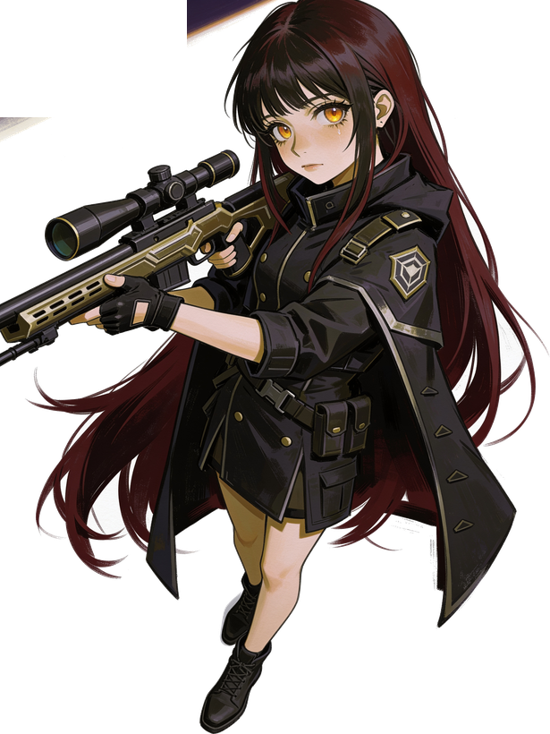
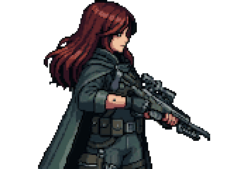

# 베스퍼 회랑 (Vesper) — 다크SF 픽셀 라인배틀러

Godot로 개발 중인 다크 SF 픽셀아트 라인배틀러 게임. 카운터사이드류 전투를 개선한 방향.

> 미공개 게임(개발 중). 이 저장소는 아트·파이프라인 설명이며 게임 소스/디자인은 비공개입니다.

  
  

## 아트 파이프라인 (핵심)
인게임 스프라이트는 **AI 일러스트 → 자동 픽셀화** 파이프라인으로 제작:
- 고해상 캐릭터 일러(사격 모션 등 포즈 프레임) → **감마보정 다운스케일 + OKLab 팔레트 통일**로 게임 스프라이트화
- 캐릭터별 잠긴 팔레트로 walk/combat 등 모든 모션 색 일관성 자동 유지
- 이 파이프라인을 재사용 가능한 MCP 서버로 코드화 → [**PixelForge MCP**](https://github.com/mindsurf0176-ui/pixelforge-mcp)

> 위 combat GIF은 256px 일러 9프레임을 PixelForge로 픽셀화·팔레트 통일한 결과.

## 기술
Godot 4 · GDScript · AI 일러 생성 + 자동 픽셀화 파이프라인(PixelForge)

## 상태
전투 코어 개발 중 (MVP1 완성)
