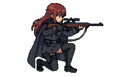
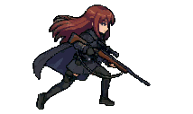
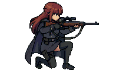

# 베스퍼 회랑 (Vesper) — 다크 SF 라인배틀러

Godot으로 개발 중인 다크 SF 라인배틀러입니다. 이 저장소에는 실제 전투 화면과 현재 사용 중인 캐릭터 에셋 파이프라인의 결과를 공개합니다.

> 게임 소스와 디자인 문서는 비공개입니다. 아래 이미지는 Godot 런타임에서 직접 캡처한 화면과 내보낸 프레임입니다.

## 실제 인게임 화면

  

## 애니메이션 상태별 프레임

| IDLE | WALK | AIM | ATTACK | HIT | DEATH |
|---|---|---|---|---|---|
|  |  |  |  |  |  |

## 캐릭터 에셋 파이프라인

- `idle · walk · aim · attack · hit · death` 6개 상태, 런타임 프레임 33개
- 파츠 추출, 리그 매니페스트, 포즈 생성, 프레임 렌더, 아틀라스와 Godot 씬 내보내기를 Python 도구 16개로 분리
- 같은 FK 계산을 서로 다른 단계에서 대조해 관절 좌표 오차를 0.5px 이내로 검증
- Godot headless import/load 검증 뒤 실제 전투 씬에서 방향 전환·애니메이션 상태를 확인

## 기술

Godot 4.6 · GDScript · Python · Pillow/NumPy · ffmpeg · headless runtime QA

## 상태

캐릭터 애니메이션을 전투 씬에 통합하고 런타임 QA를 진행 중입니다.
